# CMOS_ALU
4-Bit CMOS ALU Layout Design in 130 Nanometer Technology. Consists of a 4-1 Mux, which drives NAND, NOR, AND, OR operations based on the select signals of S0 and S1.

## Preliminary Stuff
Main schematic and layout is under the "main" directory.

| Filename | Purpose |
|----------|---------|
|top_schematic.sch | Schematic capture of ALU |
|top_schematic.spice| Spice simulation from schematic capture |
|xschemrc| Important file pointing to the source of the PDK |
|layout.mag| Layout design of the ALU |
|magic_output.spice| Spice output describing layout devices |
|magic_output_sim.spice| Schematic capture simulation devices replaced with the layout devices, to observe outputs|

This high level diagram showcases the general design of the project.

### Tools Used

- Xschem + Sky130 

- Ngspice

- MagicVLSI + Sky130

- Netgen

### High Level Schematic

### Inputs and Expected Outputs

| A   | B    | Y    | Operation (sel)|
|-----|------|------|----------------|
|0011 | 0100 | 1111 | NAND - 00      |
|1000 | 0010 | 0101 | NOR  - 01      |
|1010 | 0110 | 0010 | AND  - 10      |
|0010 | 0011 | 0011 | OR   - 11      |
|1001 | 1101 | 0110 | NAND - 00      |
|1000 | 1000 | 0111 | NOR  - 01      |
|1010 | 0110 | 0010 | AND  - 10      |
|1100 | 0110 | 1110 | OR   - 11      |

## Transistor Schematic

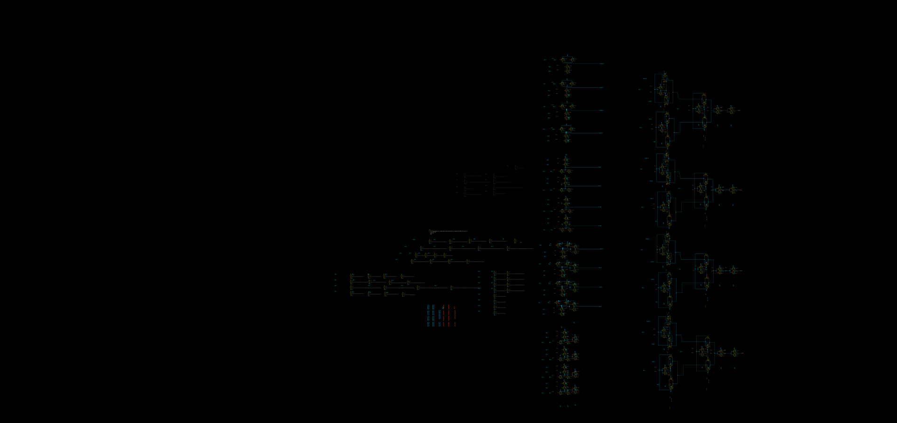

## Layout Design

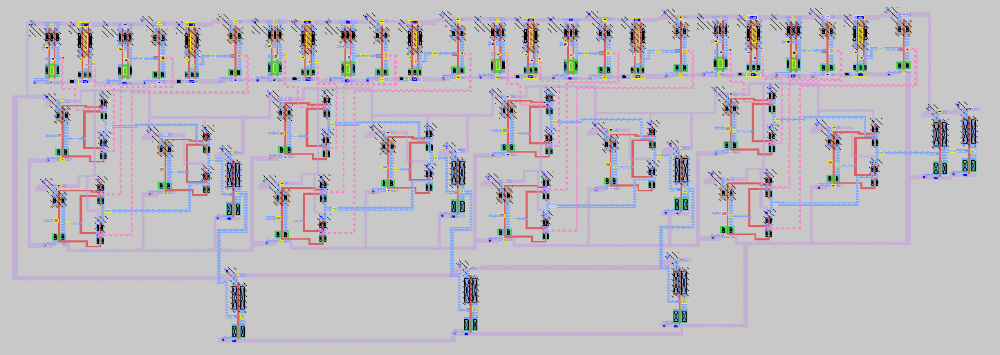

## Data

### DRC and LVS Checks

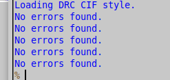

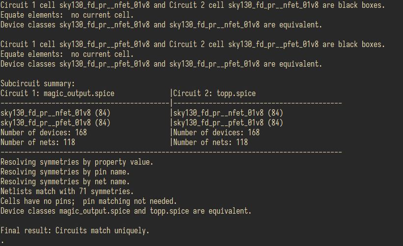

### Simulation Data

Simulation data shown below comes from the magic_output_sim.spice simulation, where the results are within 15% difference between the original schematic capture and layout design.

| Delay (Worst Case) | Average Power | Area           | 
|--------------------|---------------|----------------|
| 2.19[ns]           | 382.55[uW]    | 7155.97 [um^2] |

The simulation graphs in the followin subsection showcase the expected outcomes that were previously mentioned.

| A   | B    | Y    | Operation (sel)|
|-----|------|------|----------------|
|0011 | 0100 | 1111 | NAND - 00      |
|1000 | 0010 | 0101 | NOR  - 01      |
|1010 | 0110 | 0010 | AND  - 10      |
|0010 | 0011 | 0011 | OR   - 11      |
|1001 | 1101 | 0110 | NAND - 00      |
|1000 | 1000 | 0111 | NOR  - 01      |
|1010 | 0110 | 0010 | AND  - 10      |
|1100 | 0110 | 1110 | OR   - 11      |

#### Image Outputs

Comparison between layout and schematic outputs. F0, F1, F2, F3 represent the final outputs for the respective bits of 0, 1, 2, and 3.

Magic:
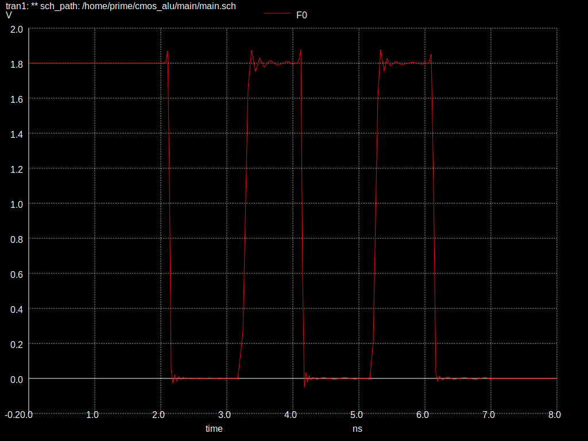

Xschem:
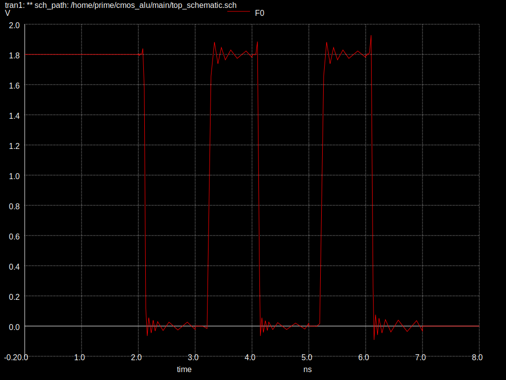

Magic:
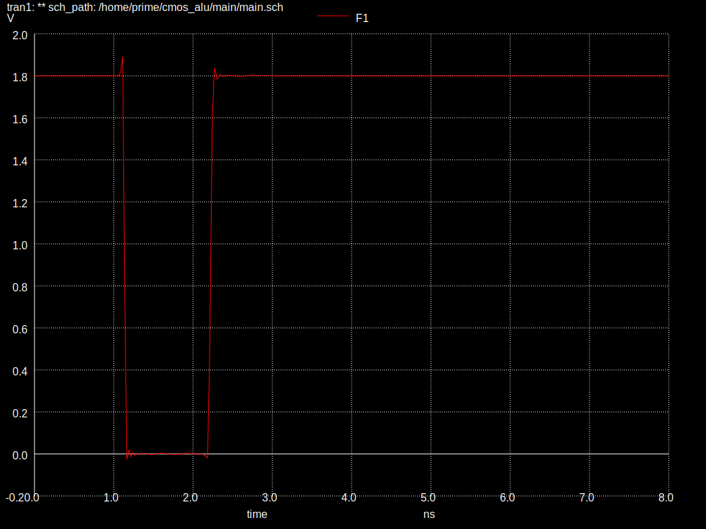

Xschem:
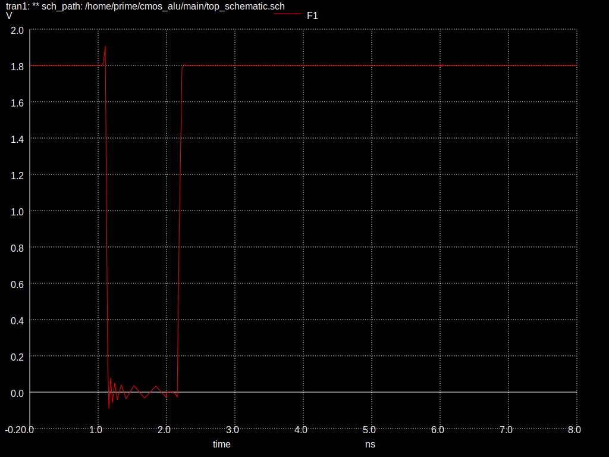

Magic:
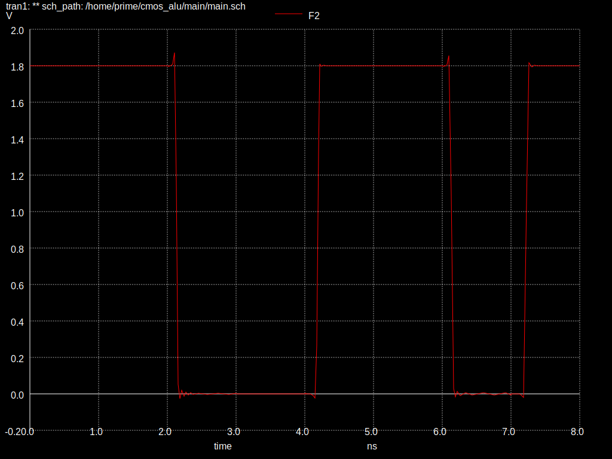

Xschem:
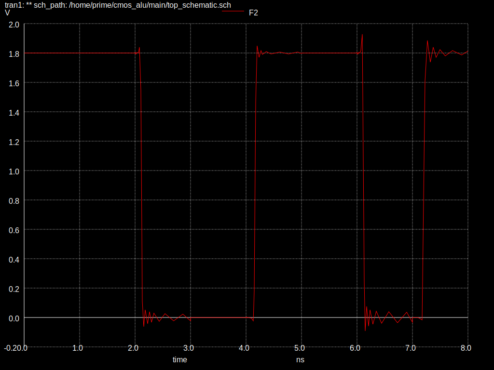

Magic:
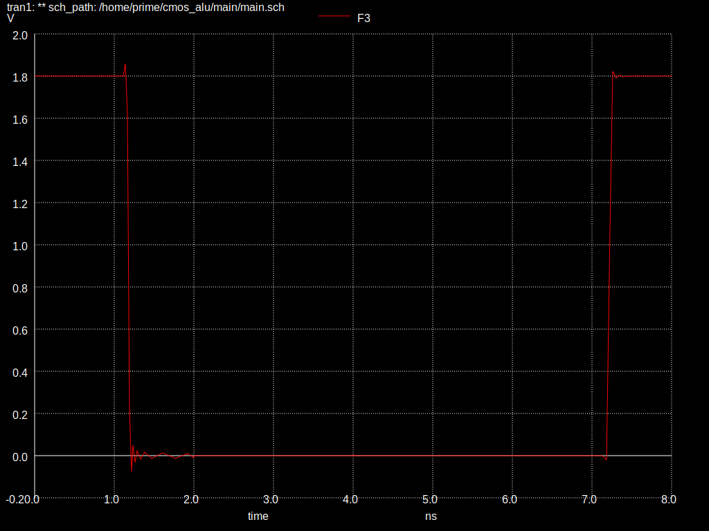

Xschem:
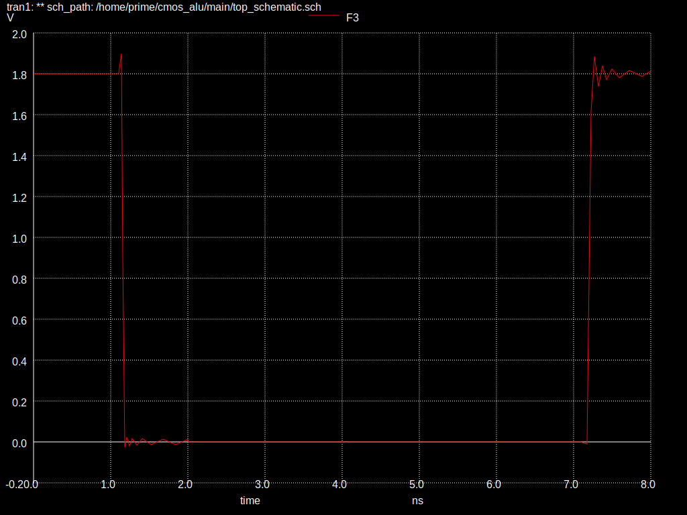

